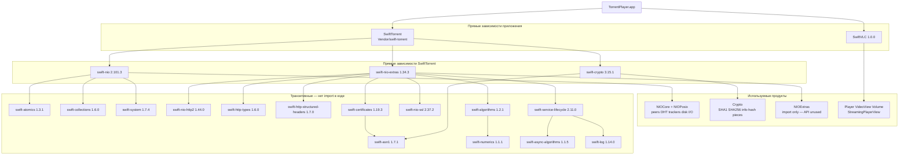

# SPM-зависимости TorrentPlayer

Источник версий: [`Package.resolved`](TorrentPlayer.xcodeproj/project.xcworkspace/xcshareddata/swiftpm/Package.resolved) и [`Vendor/swift-torrent/Package.swift`](Vendor/swift-torrent/Package.swift).

## Сводка

| Категория | Количество |
|---|---|
| Прямые пакеты приложения (Xcode) | 2 — `SwiftTorrent`, `SwiftVLC` |
| Прямые зависимости SwiftTorrent | 3 — `swift-nio`, `swift-nio-extras`, `swift-crypto` |
| Транзитивные remote-пакеты в lockfile | 14 |
| Модули, которые реально `import`-ятся | `SwiftTorrent`, `SwiftVLC`, `NIOCore`, `NIOPosix`, `NIOExtras`, `Crypto` |

Большая часть «лишних» пакетов в Xcode — транзитивный граф Apple SPM, а не прямые зависимости приложения.

## Диаграмма

## Прямые зависимости

| Пакет | Версия / источник | Роль | Назначение в проекте | Ключевые файлы |
|---|---|---|---|---|
| **SwiftTorrent** | local `Vendor/swift-torrent` | Прямая (app) | BitTorrent-движок: magnet, metadata, peers, DHT, trackers, sequential download, streaming | `TorrentPlayer/Torrent/TorrentEngine.swift`, `TPLog.swift`, `TorrentFileItem.swift` |
| **SwiftVLC** | 1.0.0 (`harflabs/SwiftVLC`) | Прямая (app) | Встроенный VLC для контейнеров вроде MKV/AVI (`Player`, `VideoView`, `Volume`) | `TorrentPlayer/Screens/StreamingPlayerView.swift` |
| **swift-nio** | 2.101.3 | Прямая (SwiftTorrent) | TCP peer-соединения, UDP DHT/trackers, event loops, disk I/O thread pool | `Session/`, `Peer/`, `DHT/`, `Tracker/`, `Storage/DiskIO.swift` |
| **swift-nio-extras** | 1.34.3 | Прямая (SwiftTorrent) | Продукт `NIOExtras` объявлен и импортирован, но API не вызывается | `Peer/PeerConnection.swift` (только `import`) |
| **swift-crypto** | 3.15.1 | Прямая (SwiftTorrent) | SHA-1 / SHA-256 для info-hash, piece verify, BEP-9 metadata | `Torrent/InfoHash.swift`, `PiecePicker/PieceManager.swift`, `Peer/MetadataExchange.swift` |

Продукты, связанные в `Package.swift` SwiftTorrent: `NIO`, `NIOCore`, `NIOPosix`, `NIOExtras`, `Crypto`.  
`import NIO` в исходниках нет; фактически используются `NIOCore` и `NIOPosix`.

## Транзитивные зависимости

Не импортируются кодом приложения или Vendor. Попадают в граф из-за package-level зависимостей `swift-nio`, `swift-nio-extras` и `swift-crypto`.

| Пакет | Версия | Почему в графе |
|---|---|---|
| swift-atomics | 1.3.1 | Зависимость `swift-nio` |
| swift-collections | 1.6.0 | Зависимость `swift-nio` (и async-algorithms) |
| swift-system | 1.7.4 | Зависимость `swift-nio` |
| swift-asn1 | 1.7.1 | Зависимость `swift-crypto` / certificates |
| swift-nio-http2 | 1.44.0 | Package-level dep `swift-nio-extras` |
| swift-http-types | 1.6.0 | Package-level dep `swift-nio-extras` |
| swift-http-structured-headers | 1.7.0 | Package-level dep `swift-nio-extras` |
| swift-algorithms | 1.2.1 | Package-level dep `swift-nio-extras` |
| swift-numerics | 1.1.1 | Зависимость `swift-algorithms` |
| swift-nio-ssl | 2.37.2 | Package-level dep `swift-nio-extras` |
| swift-certificates | 1.19.3 | Package-level dep `swift-nio-extras` |
| swift-service-lifecycle | 2.11.0 | Package-level dep `swift-nio-extras` |
| swift-async-algorithms | 1.1.5 | Зависимость service-lifecycle / nio-extras |
| swift-log | 1.14.0 | Зависимость service-lifecycle / nio-extras |

## Заметки

- **`NIOExtras`**: импорт есть, вызовов API нет; при этом пакет тянет большую часть транзитивного графа (HTTP2, SSL, certificates, lifecycle и т.д.).
- **SwiftVLC** внутри использует binary `libvlc` xcframework; его SPM-deps для docs/tests (`swift-docc-plugin`, `swift-custom-dump`) в app lockfile как runtime не фигурируют.
- Тестовые таргеты Xcode не линкуют SPM-продукты напрямую; `SwiftTorrent` доступен через app / `@testable import`.
